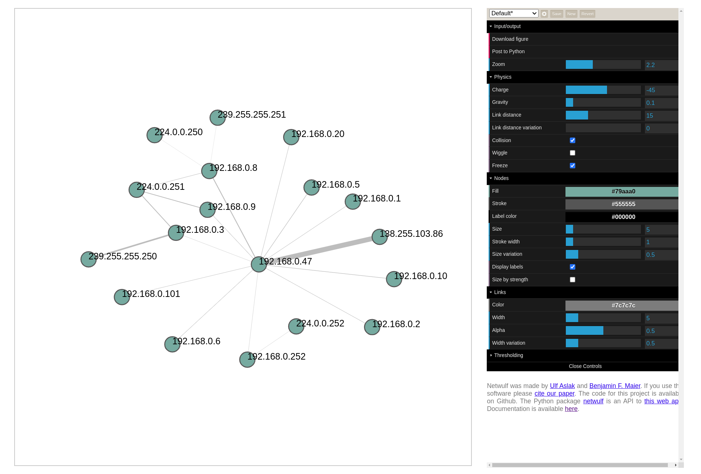

Network graphing tool, based on captured traffic. 
Connects different IP addresses using traffic from a pcap file. 

## Install

```
git clone 
cd netgraph
pip install -r requirements.txt
```

## Example

```
$ python netgraph.py -p example.pcapng                                                                                         
2053it [00:00, 6823.35it/s]
Opening in existing browser session.
```


